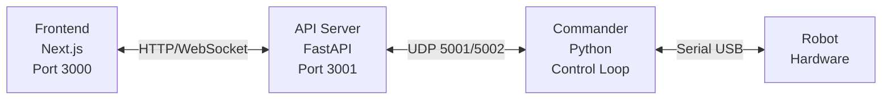
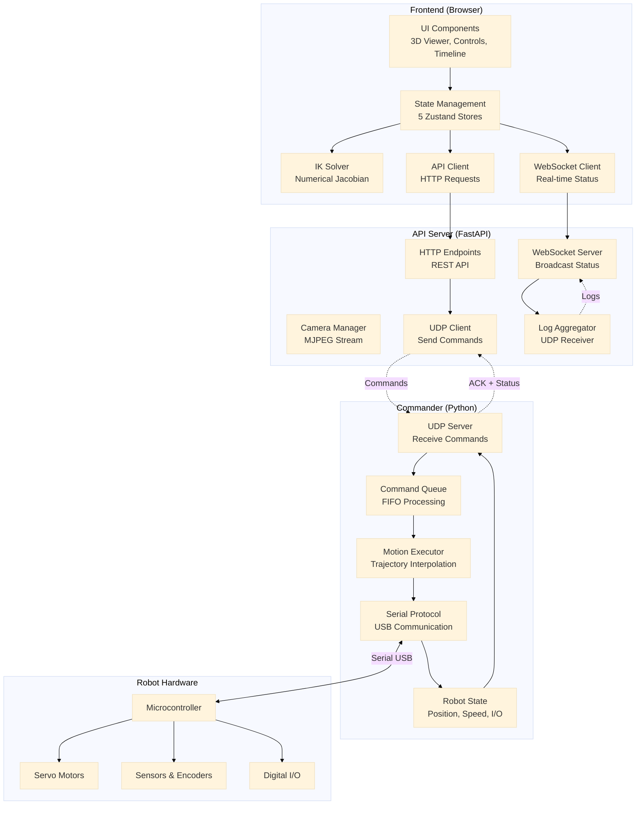

# PAROL6 Robot Control System

A modern, web-based control system for the PAROL6 6-axis robotic arm featuring real-time 3D visualization, timeline-based motion programming, and advanced kinematics.

## Features

- **Real-time 3D Visualization** - Interactive 3D robot model with live hardware tracking
- **Dual Control Modes** - Joint space and Cartesian space motion control
- **Timeline Editor** - Visual programming with keyframe-based motion sequences
- **Live Control** - Real-time hardware following with trajectory preview
- **Advanced Kinematics** - Frontend IK solver with numerical stability and singularity handling
- **Tool Management** - Configurable end-effectors with TCP offset and gripper support
- **WebSocket Streaming** - High-frequency robot status updates (1-50Hz)
- **Camera Integration** - Optional camera feed with MJPEG streaming
- **Saved Positions** - Store and recall common robot configurations
- **Comprehensive API** - RESTful API for all robot operations

## Architecture

### System Overview


### Detailed Architecture


**Key Data Flows:**
- **User Control:** UI → State → API → Commander → Robot
- **Live Feedback:** Robot → Commander → WebSocket → Frontend UI
- **IK Solving:** Target Pose → IK Solver → Joint Angles → Commander
- **Logging:** Commander → UDP → API → WebSocket → Browser Console

## Hardware Requirements

- **Robot**: PAROL6 6-axis robotic arm
- **Computer**: Raspberry Pi 4/5 or Linux PC recommended
- **Connection**: USB serial connection to robot controller
- **Optional**: USB camera for vision integration

## Software Requirements

### System Dependencies
- **Python**: 3.9 or higher
- **Node.js**: 18.x or higher
- **npm**: 9.x or higher
- **PM2**: Process manager (install globally: `npm install -g pm2`)

### Python Dependencies
See `requirements.txt` for complete list. Key dependencies:
- FastAPI (web framework)
- uvicorn (ASGI server)
- pyserial (robot communication)
- numpy (numerical computing)
- spatialmath-python (kinematics)
- roboticstoolbox-python (IK solver)
- opencv-python (camera support)

### Node.js Dependencies
Managed automatically via `package.json`:
- next (React framework)
- react, react-dom (UI library)
- three, @react-three/fiber (3D rendering)
- zustand (state management)
- tailwindcss (styling)

## Installation

### 1. Clone the Repository
```bash
git clone <repository-url>
cd parol6
git submodule update --init --recursive
```

### 2. Install Python Dependencies
```bash
# Create virtual environment (recommended)
python3 -m venv venv
source venv/bin/activate  # On Windows: venv\Scripts\activate

# Install dependencies
pip install -r requirements.txt
```

**Note**: The `rtb-reference/` directory contains the Robotics Toolbox library required for IK solving. Ensure it's present (not in .gitignore for fresh installs).

### 3. Install Node.js Dependencies
```bash
cd frontend
npm install
cd ..
```

### 4. Install PM2 (Process Manager)
```bash
npm install -g pm2
```

### 5. Configure the System

Edit `config.yaml` for your environment:

```yaml
robot:
  com_port: /dev/ttyACM0  # Serial port for robot
  baud_rate: 3000000      # Communication speed

api:
  host: 0.0.0.0
  port: 3001
```

## Quick Start

### Start All Processes
```bash
# Start frontend, API, and commander
pm2 start ecosystem.config.js

# View logs
pm2 logs

# Stop all
pm2 stop all
```

### Access the Interface
Open your browser to:
- **Frontend**: http://localhost:3000
- **API Docs**: http://localhost:3001/docs

### Individual Process Control
```bash
# Start only frontend (development mode)
cd frontend && npm run dev

# Start only API server
cd api && python3 fastapi_server.py

# Start only commander
python3 commander/commander.py
```

## Configuration

### Serial Port Setup
Ensure your user has permission to access the serial port:
```bash
# Add user to dialout group
sudo usermod -a -G dialout $USER

# Log out and back in for changes to take effect
```

### Camera Setup
If using a USB camera:
```yaml
camera:
  auto_start: true
  default_device: /dev/video0
  resolution:
    width: 640
    height: 480
```

### Network Access
To access from other devices on your network:

1. Find your server's IP address:
   ```bash
   hostname -I
   ```

2. Access from other devices: `http://<your-ip>:3000`

The frontend automatically detects the API at the same hostname on port 3001.

## Development

### Project Structure
```
parol6/
├── api/                    # FastAPI backend
│   ├── fastapi_server.py   # Main API server
│   ├── robot_client.py     # UDP client to commander
│   └── websocket_manager.py
├── commander/              # Robot control
│   ├── commander.py        # Main control loop
│   └── commands.py         # Command processors
├── frontend/               # Next.js frontend
│   ├── app/
│   │   ├── page.tsx        # Main control interface
│   │   ├── components/     # React components
│   │   ├── hooks/          # Custom hooks
│   │   └── lib/            # Utilities & stores (includes IK solver)
│   └── public/
│       └── urdf/           # Robot URDF model & meshes
├── lib/                    # Shared Python libraries
│   ├── models/             # Data models
│   └── utils/              # Utilities
├── config.yaml             # System configuration
├── ecosystem.config.js     # PM2 process config
└── requirements.txt        # Python dependencies
```

### Development Workflow

1. **Frontend Development**
   ```bash
   cd frontend
   npm run dev  # Hot reload on port 3000
   ```

2. **API Development**
   ```bash
   cd api
   python3 fastapi_server.py  # Uvicorn auto-reload
   ```

3. **Testing Changes**
   - Frontend changes: Automatic hot reload
   - API changes: Automatic uvicorn reload
   - Commander changes: Restart with `pm2 restart commander`

### Building for Production

```bash
# Build frontend
cd frontend
npm run build

# Start production build
npm start
```

## API Documentation

### REST Endpoints
Full API documentation available at `http://localhost:3001/docs` (Swagger UI)

Key endpoints:
- `GET /api/robot/status` - Complete robot state
- `POST /api/robot/move/joint` - Joint space motion
- `POST /api/robot/move/pose` - Cartesian motion with IK
- `POST /api/robot/move/cartesian` - Linear Cartesian motion
- `GET /api/config` - System configuration
- `POST /api/config/tools` - Tool management

### WebSocket Topics
Connect to `ws://localhost:3001/ws` and subscribe to topics:
- `status` - Robot state (position, speed, I/O)
- `logs` - System logs
- `camera` - Camera feed (if enabled)

## Troubleshooting

### Robot Not Connecting
```bash
# Check serial port
ls -l /dev/ttyACM*

# Test port access
python3 -c "import serial; serial.Serial('/dev/ttyACM0', 3000000)"

# Check permissions
groups  # Should include 'dialout'
```

### PM2 Process Crashes
```bash
# View error logs
pm2 logs --err

# Restart specific process
pm2 restart frontend
pm2 restart api
pm2 restart commander

# Check process status
pm2 status
```

### Frontend Can't Connect to API
1. Verify API is running: `curl http://localhost:3001/health`
2. Check CORS origins in `config.yaml`
3. Check frontend API URL in `frontend/.env.local`
4. Clear browser cache and reload

### IK Solver Fails
- Check target pose is reachable (run `/api/ik` endpoint to test)
- Verify URDF model is loaded correctly
- Check joint limits in `config.yaml`
- Review IK solver logs for singularity warnings

### Camera Not Working
```bash
# List available cameras
v4l2-ctl --list-devices

# Test camera
ffplay /dev/video0

# Update config.yaml with correct device
```

## Deployment Checklist

- [ ] Install all dependencies (Python, Node.js, PM2)
- [ ] Configure `config.yaml` (serial port, network IPs)
- [ ] Set frontend environment variables (`frontend/.env.local`)
- [ ] Test serial port access (`ls -l /dev/ttyACM*`)
- [ ] Build frontend (`cd frontend && npm run build`)
- [ ] Start PM2 processes (`pm2 start ecosystem.config.js`)
- [ ] Configure PM2 auto-start (`pm2 startup && pm2 save`)
- [ ] Test web interface access (http://localhost:3000)
- [ ] Test robot connection and basic movements
- [ ] Configure firewall rules (if needed)

## Safety

**IMPORTANT**: This system controls a physical robot capable of causing injury.

- Always ensure emergency stop is accessible
- Keep workspace clear of people during operation
- Test new motions at low speed first
- Monitor robot during autonomous operation
- Respect joint limits and workspace boundaries
- Never bypass safety features

## License

[Add your license here]

## Support & Contributing

[Add support/contribution information]

## Acknowledgments

**Based on:**
- [PAROL6 Desktop Robot Arm](https://github.com/PCrnjak/PAROL6-Desktop-robot-arm) by PCrnjak - Robot hardware design
- [PAROL6 Python API](https://github.com/PCrnjak/PAROL6-python-API) by PCrnjak - Commander architecture and serial protocol

**Built with:**
- [FastAPI](https://fastapi.tiangolo.com/) - API framework
- [Next.js](https://nextjs.org/) - Frontend framework
- [React Three Fiber](https://docs.pmnd.rs/react-three-fiber) - 3D visualization
