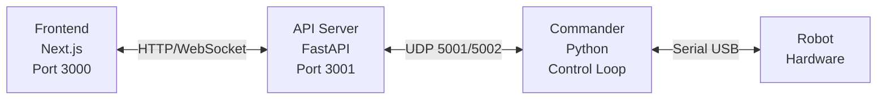

# PAROL6 Robot Control System

A modern, web-based control system for the PAROL6 6-axis robotic arm featuring real-time 3D visualization, timeline-based motion programming, and advanced kinematics.

## Features

- **Real-time 3D Visualization** - Interactive 3D robot model with live hardware tracking
- **Dual Control Modes** - Joint space and Cartesian space motion control
- **Timeline Editor** - Visual programming with keyframe-based motion sequences
- **Live Control** - Real-time hardware following with trajectory preview
- **Advanced Kinematics** - Frontend IK solver with numerical stability and singularity handling
- **Tool Management** - Configurable end-effectors with TCP offset and gripper support
- **WebSocket Streaming** - High-frequency robot status updates (1-50Hz)
- **Camera Integration** - Optional camera feed with MJPEG streaming
- **Saved Positions** - Store and recall common robot configurations
- **Comprehensive API** - RESTful API for all robot operations

## Architecture

### System Overview


## Hardware Requirements

- **Robot**: PAROL6 6-axis robotic arm
- **Computer**: Raspberry Pi 4/5 or Linux PC recommended
- **Connection**: USB serial connection to robot controller
- **Optional**: USB camera for vision integration

## Software Requirements

### System Dependencies
- **Python**: 3.9 or higher
- **Node.js**: 18.x or higher
- **npm**: 9.x or higher
- **PM2**: Process manager (install globally: `npm install -g pm2`)

### Python Dependencies
See `requirements.txt` for complete list. Key dependencies:
- FastAPI (web framework)
- uvicorn (ASGI server)
- pyserial (robot communication)
- numpy (numerical computing)
- opencv-python (camera support)

### Node.js Dependencies
Managed automatically via `package.json`:
- next (React framework)
- react, react-dom (UI library)
- three, @react-three/fiber (3D rendering)
- zustand (state management)
- tailwindcss (styling)

## Installation

### 1. Clone the Repository
```bash
git clone <repository-url>
cd parol6
git submodule update --init --recursive
```

### 2. Install Python Dependencies
```bash
# Create virtual environment (recommended)
python3 -m venv venv
source venv/bin/activate  # On Windows: venv\Scripts\activate

# Install dependencies
pip install -r requirements.txt
```

**Note**: The `rtb-reference/` directory contains the Robotics Toolbox library required for IK solving. Ensure it's present (not in .gitignore for fresh installs).

### 3. Install Node.js Dependencies
```bash
cd frontend
npm install
cd ..
```

### 4. Install PM2 (Process Manager)
```bash
npm install -g pm2
```

### 5. Configure the System

Edit `config.yaml` for your environment:

```yaml
robot:
  com_port: /dev/ttyACM0  # Serial port for robot
  baud_rate: 3000000      # Communication speed

api:
  host: 0.0.0.0
  port: 3001
```

## Docker Deployment (Alternative)

For production deployment, pre-built multi-architecture Docker images are available. This is the recommended method for production environments.

### Prerequisites
- Docker and Docker Compose installed
- Serial port access (`/dev/ttyACM0` - adjust if different)
- `config.yaml` file configured

### Pull and Run
```bash
# Create config.yaml first (see Configuration section)

# Pull and start all services
docker-compose pull
docker-compose up -d

# View logs
docker-compose logs -f

# Stop services
docker-compose down
```

### Docker Images
Pre-built images are automatically published for both `amd64` and `arm64` architectures:
- `ghcr.io/jointaxis77/parol6-webcommander/frontend:latest`
- `ghcr.io/jointaxis77/parol6-webcommander/api:latest`
- `ghcr.io/jointaxis77/parol6-webcommander/commander:latest`

### Serial Port Configuration
If your robot uses a different serial port, update `docker-compose.yml`:
```yaml
commander:
  devices:
    - "/dev/ttyUSB0:/dev/ttyUSB0"  # Change to your port
```

### Building Images Locally (Optional)
```bash
# Build all images
docker build -t parol6-frontend:local -f frontend/Dockerfile frontend/
docker build -t parol6-api:local -f Dockerfile.api .
docker build -t parol6-commander:local -f Dockerfile.commander .

# Update docker-compose.yml to use local images
```

## Quick Start

### Start All Processes
```bash
# Start frontend, API, and commander
pm2 start ecosystem.config.js

# View logs
pm2 logs

# Stop all
pm2 stop all
```

### Access the Interface
Open your browser to:
- **Frontend**: http://localhost:3000
- **API Docs**: http://localhost:3001/docs

### Individual Process Control
```bash
# Start only frontend (development mode)
cd frontend && npm run dev

# Start only API server
cd api && python3 fastapi_server.py

# Start only commander
python3 commander/commander.py
```

## Configuration

### Serial Port Setup
Ensure your user has permission to access the serial port:
```bash
# Add user to dialout group
sudo usermod -a -G dialout $USER

# Log out and back in for changes to take effect
```

### Camera Setup
If using a USB camera:
```yaml
camera:
  auto_start: true
  default_device: /dev/video0
  resolution:
    width: 640
    height: 480
```

### Network Access
To access from other devices on your network:

1. Find your server's IP address:
   ```bash
   hostname -I
   ```

2. Access from other devices: `http://<your-ip>:3000`

The frontend automatically detects the API at the same hostname on port 3001.

## Development

### Project Structure
```
parol6/
├── api/                    # FastAPI backend
│   ├── fastapi_server.py   # Main API server
│   ├── robot_client.py     # UDP client to commander
│   └── websocket_manager.py
├── commander/              # Robot control
│   ├── commander.py        # Main control loop
│   └── commands.py         # Command processors
├── frontend/               # Next.js frontend
│   ├── app/
│   │   ├── page.tsx        # Main control interface
│   │   ├── components/     # React components
│   │   ├── hooks/          # Custom hooks
│   │   └── lib/            # Utilities & stores (includes IK solver)
│   └── public/
│       └── urdf/           # Robot URDF model & meshes
├── lib/                    # Shared Python libraries
│   ├── models/             # Data models
│   └── utils/              # Utilities
├── config.yaml             # System configuration
├── ecosystem.config.js     # PM2 process config
└── requirements.txt        # Python dependencies
```

## API Documentation

Full API documentation available at `http://localhost:3001/redoc`

### Key Endpoints

**Robot Control:**
- `POST /api/robot/move/joints` - Move robot to target joint angles
- `POST /api/robot/execute/trajectory` - Execute multi-waypoint trajectory
- `POST /api/robot/home` - Home the robot
- `POST /api/robot/stop` - Stop current motion
- `POST /api/robot/clear-estop` - Clear emergency stop

**Gripper Control:**
- `POST /api/robot/gripper/electric` - Control electric gripper
- `POST /api/robot/gripper/pneumatic` - Control pneumatic gripper

**Tool Management:**
- `GET /api/config/tools` - List all tools
- `POST /api/config/tools` - Create new tool
- `PATCH /api/config/tools/{tool_id}` - Update tool
- `DELETE /api/config/tools/{tool_id}` - Delete tool
- `POST /api/config/tools/{tool_id}/mount` - Mount tool as active

**Configuration:**
- `GET /api/config` - Get system configuration
- `PATCH /api/config` - Update configuration

**Camera:**
- `GET /api/camera/status` - Camera status
- `POST /api/camera/start` - Start camera stream
- `POST /api/camera/stop` - Stop camera stream
- `GET /api/camera/stream` - MJPEG camera stream

**Logs:**
- `GET /api/logs` - Get system logs
- `DELETE /api/logs` - Clear logs

### WebSocket Topics
Connect to `ws://localhost:3001/ws` and subscribe to topics:
- `status` - Robot state (position, speed, I/O)
- `logs` - System logs
- `camera` - Camera feed (if enabled)

## Deployment Checklist

- [ ] Install all dependencies (Python, Node.js, PM2)
- [ ] Configure `config.yaml` (serial port, network IPs)
- [ ] Set frontend environment variables (`frontend/.env.local`)
- [ ] Test serial port access (`ls -l /dev/ttyACM*`)
- [ ] Build frontend (`cd frontend && npm run build`)
- [ ] Start PM2 processes (`pm2 start ecosystem.config.js`)
- [ ] Configure PM2 auto-start (`pm2 startup && pm2 save`)
- [ ] Test web interface access (http://localhost:3000)
- [ ] Test robot connection and basic movements
- [ ] Configure firewall rules (if needed)

## Safety

**IMPORTANT**: This system controls a physical robot capable of causing injury.

- Always ensure emergency stop is accessible
- Keep workspace clear of people during operation
- Test new motions at low speed first
- Monitor robot during autonomous operation
- Respect joint limits and workspace boundaries
- Never bypass safety features

## License

[Add your license here]

## Support & Contributing

[Add support/contribution information]

## Acknowledgments

**Based on:**
- [PAROL6 Desktop Robot Arm](https://github.com/PCrnjak/PAROL6-Desktop-robot-arm) by PCrnjak - Robot hardware design
- [PAROL6 Python API](https://github.com/PCrnjak/PAROL6-python-API) by PCrnjak - Commander architecture and serial protocol
- [PAROL6 Python API](https://github.com/Jepson2k/PAROL6-python-API/) by Jepson2k - Extended functionality and improvements

**Built with:**
- [FastAPI](https://fastapi.tiangolo.com/) - API framework
- [Next.js](https://nextjs.org/) - Frontend framework
- [React Three Fiber](https://docs.pmnd.rs/react-three-fiber) - 3D visualization
