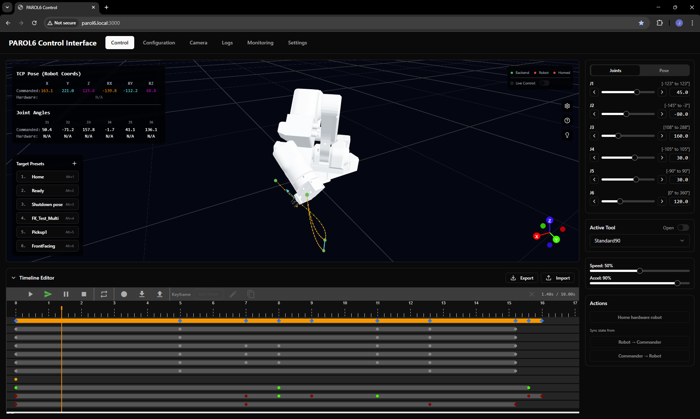

# Pilot

**Pilot** is a modern web-based control system for the [PAROL6](https://github.com/PCrnjak/PAROL6-Desktop-robot-arm) 6-axis robotic arm. It provides an intuitive browser interface with real-time 3D visualization, timeline-based motion programming, and live robot control.

!!! info "About PAROL6"
    PAROL6 is an open-source 6-axis robotic arm created by [Source Robotics](https://source-robotics.com/). If you're building or learning about the robot itself, check out:

    - [PAROL6 GitHub Repository](https://github.com/PCrnjak/PAROL6-Desktop-robot-arm) - Hardware designs, BOM, and assembly instructions
    - [Official PAROL6 Documentation](https://source-robotics.github.io/PAROL-docs/) - Comprehensive guides for building and calibrating your robot

    **Pilot** is a community-developed control interface that runs alongside your PAROL6 robot.

## Features

- **Real-time 3D Visualization** - Interactive 3D robot model with live hardware tracking
- **Dual Control Modes** - Joint space and Cartesian space motion control
- **Timeline Editor** - Visual programming with keyframe-based motion sequences
- **Live Control** - Real-time hardware following with trajectory preview
- **Tool Management** - Configurable end-effectors with TCP offset and gripper support
- **WebSocket Streaming** - High-frequency robot status updates

## Quick Links

-   :material-download:{ .lg .middle } __Installation__

    ---

    Get Pilot up and running on your system

    [:octicons-arrow-right-24: Installation Guide](getting-started/installation.md)

-   :material-cog:{ .lg .middle } __Configuration__

    ---

    Configure serial ports, network settings, and tools

    [:octicons-arrow-right-24: Configuration Guide](getting-started/configuration.md)

-   :material-rocket-launch:{ .lg .middle } __Quick Start__

    ---

    Move your robot for the first time

    [:octicons-arrow-right-24: Quick Start](getting-started/quick-start.md)

-   :material-monitor:{ .lg .middle } __Interface Overview__

    ---

    Learn the control interface

    [:octicons-arrow-right-24: Interface Guide](user-guide/interface-overview.md)

## System Requirements

| Component | Requirement |
|-----------|-------------|
| Robot | PAROL6 6-axis robotic arm |
| Computer | Raspberry Pi 4/5 or Linux PC |
| Python | 3.9 or higher |
| Node.js | 18.x or higher |
| Connection | USB serial to robot controller |

## Getting Help

!!! tip "Beta Software"
    Pilot is beta software under active development. Expect occasional bugs and quirks.

- **Discord**: Join the [#pilot channel](https://discord.com/channels/1072498136284667955/1436740840818217054) on the Source Robotics Discord for support and discussion
- **GitHub**: Report issues or contribute at [GitHub](https://github.com/jointAxis77/parol6-webcommander)
