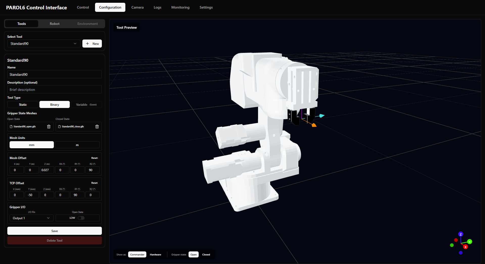

# Tool Management

Tools (end-effectors) are devices mounted to the robot's J6 flange. Configure them in Pilot at `/configuration`.

## Creating a New Tool

1. Go to **Configuration** page (`/configuration`)
2. Click the **New** button next to the tool selector
3. Fill in the tool details:

| Field | Description |
|-------|-------------|
| **Name** | Display name for the tool (required) |
| **Description** | Optional description |
| **Tool Type** | Static (fixed tool) or Binary (gripper with open/close) |

4. Upload a 3D mesh file (optional but recommended):
   - Drag & drop or click the upload area
   - Supported formats: `.stl`, `.glb`, `.gltf`
   - Select **Mesh Units** (mm or m) to match your file

5. Adjust the **Mesh Offset** to align the 3D model visually
6. Set the **TCP Offset** to define the functional tool center point
7. Click **Create**

---

## Understanding Offsets

### Mesh Offset (Visual)

Adjusts where the 3D model appears relative to the J6 flange. Use this to align your mesh visually with the robot.

| Parameter | Unit | Description |
|-----------|------|-------------|
| X, Y, Z | meters | Position offset from flange |
| RX, RY, RZ | degrees | Rotation offset |

### TCP Offset (Functional)

Defines the **Tool Center Point** - the reference point for all Cartesian movements. When you command the robot to a position, the TCP moves there.

| Parameter | Unit | Description |
|-----------|------|-------------|
| X, Y, Z | mm | Position of TCP relative to flange |
| RX, RY, RZ | degrees | Orientation of TCP |

The 3D preview shows a TCP gizmo (three colored arrows). Adjust the offset values until:

1. The gizmo is positioned at your tool's working point (gripper tip, suction point, etc.)
2. The gizmo axes align with real-world axes

**Gizmo colors:**

| Gizmo | Axis |
|-------|------|
| Orange | X (Red) |
| Cyan | Y (Green) |
| Magenta | Z (Blue) |

!!! tip "TCP vs Mesh"
    These are independent. Mesh Offset is purely visual. TCP Offset affects robot motion calculations.

---

## Configuring Grippers (Binary Tools)

For tools with open/close functionality:

1. Set **Tool Type** to **Binary**
2. Upload separate meshes for **Open State** and **Closed State**
3. Configure **Gripper I/O**:
   - **I/O Pin**: Which digital output controls the gripper (1 or 2)
   - **Open State**: Whether HIGH or LOW signal opens the gripper

The 3D preview lets you toggle between open and closed states to verify your meshes.

---

## Selecting a Tool

On the main control page:

1. Find the **Tool** dropdown in the control panel
2. Select your tool from the list
3. The 3D view updates to show the tool
4. Cartesian coordinates now reference the new TCP

